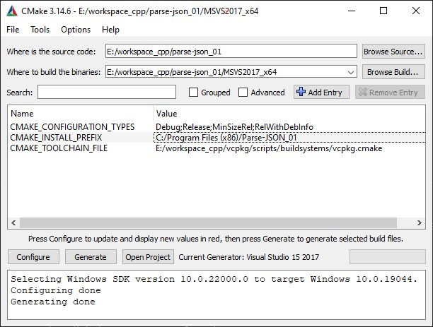
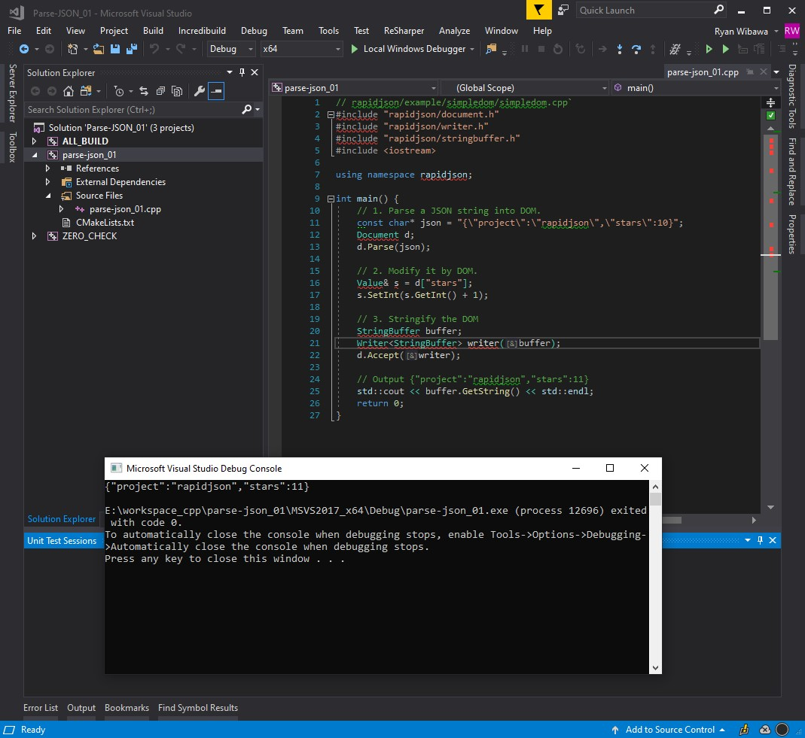

# parse-json_01
Learn `vcpkg` with C++ 11
* [vcpkg](https://github.com/Microsoft/vcpkg/#vcpkg-with-visual-studio-cmake-projects)
* [rapidjson](https://github.com/rwibawa/rapidjson)

## 1. Install **vcpkg** on win10:
```sh
$ cd /e/workspace_cpp
$ git clone https://github.com/microsoft/vcpkg
$ cd vcpkg
$ bootstrap-vcpkg.bat

# In order to use vcpkg with Visual Studio
$ vcpkg.exe integrate install 
```

## 2. Install **rapidjson**:
```sh
# to install x64 lib
$ ../vcpkg/vcpkg.exe install rapidjson:x64-windows

$ touch CMakeLists.txt
$ touch parse-json_01.cpp
```

## 3. Open **cmake-ui**:

* Add entry CMAKE_TOOLCHAIN_FILE="E:/workspace_cpp/vcpkg/scripts/buildsystems/vcpkg.cmake"
* Click *Configure*
* Click *Generate*
* Click *Open Project*


